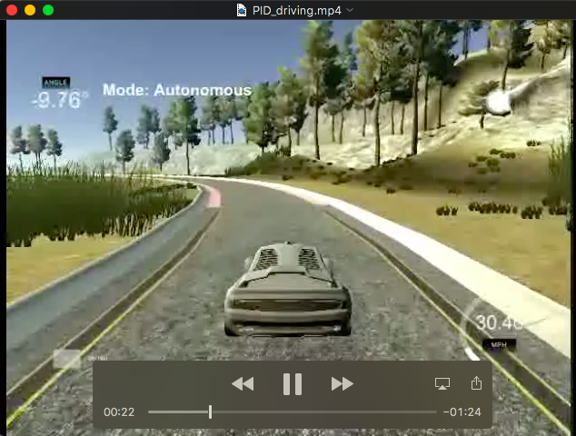

## PID Control Project (Udacity Self-Driving Car Engineer Nanodegree)

Xinjie Qiu, Auguest 19, 2018

[](http://www.udacity.com/drive)


In this project, we revisited the lake race track from the Behavioral Cloning Project (Project 3 in term 1). This time, however, we implemented a PID controller in C++ to maneuver the vehicle around the track!

The simulator provides the cross track error (CTE) to feed into PID controller to compute the appropriate steering angle.

![Car Animation][image1] 


[//]: # (Image References)
[image1]: ./PID_driving.gif "Car PID Driving Animation"
[image2]: ./PID_tuning_Kp.png "Tuning Kp"
[image3]: ./PID_tuning_Kd.png "Tuning Kd"
[image4]: ./PID_tuning_Ki.png "Tuning Ki"
[image5]: ./PID_tuning_Kd_2.png "Tuning Kd again"
[image6]: ./PID_tuning_Kp_2.png "Tuning Kp again"


PID controller Implementation
---
PID stands for **P**roportional **I**ntegral **D**erivative, each term calculate its feedback and apply a corrected based on the difference between a desired target and a measured variable.

In this project, the cross track error (CTE) is provided by the simulator. It is the off lane center distance. Its values is possitive if the vehicle is to the right of the center line, and negative if to the left.

This CTE error itself is P error. The accumulated CTE error is assigned to I error. The differential error (current CTE minus the previous CTE) is the D error. 

These errors are calculated in PID.cpp:
```
void PID::UpdateError(double cte) {
  d_error  = cte - p_error;
  p_error  = cte;
  i_error += cte;
}
```

The sum of each error multiplying by corresponding control gains (P gain, I gain, and D gain) is the total error:
```
double PID::TotalError() {
  return Kp * p_error + Kd * d_error + Ki * i_error;
}
```

The vehicle is controlled by the steering value, which is calculated from the total error with a opposite sign. The absolute value of this steering value is capped at 1.0 to prevent over controlling. 
The steering value is calculated in main.cpp: 
```
pid.UpdateError(cte);
steer_value = - pid.TotalError();

if (steer_value > 1.0)
  steer_value = 1.0;
else if (steer_value < - 1.0)
  steer_value = - 1.0;
```

PID gains tuning
---
The PID gains tuning is the most challenge part of this project. There are a few different methods for tuning the Kp, Ki and Kd.  Ways to tune the PID constants can be done by a computer program (e.g., twiddle, SGD), by maths calculations (e.g., Ziegler-Nichols method), or by manual tuning.

In this project, I decided to practice with manual tuning so we can have a visual clue on the effect of each control gains.

In each iteration, the simulator is controlled by a set of controller gains, Kp, Ki, Kd. Each message from the controller is recorded, including the timestamps and errors. 

#### 1. Kp Tuning
The Kd, Ki terms are set to zero for now, we compare the effects of varing Kp term at 0.00, 0.05 and 0.10.

![Kp Tuning][image2]

Current best gain choice: Kp = 0.05.

Increaseing the Kp gain values causes increasesing the ossiclation frequency. But too high Kp value causes overshoting. 

The witdh of the road is about 10 meters, 5 meters to each side from the center line. Even with the best Kp chosen to 0.050, the vechile still drives off the road. Let's continue tuning with other gains to see whether that will help.

#### 2. Kd Tuning
Keep Kp to 0.05, still set Ki at zero, vary Kd at 0.0, 0.1, 1.0, 5.0, 10.0,

![Kd Tuning][image3] 

Increasing Kd help to reduce the overshot effect. In these Kd gains, Kd = 10.0 has the best result. 

Current best gain choice: Kp = 0.05, Kd = 10.0.

The maximum CTE is now reduced to about 3 meters.


#### 3. Ki Tuning
There's a problems with the above choice of Kp and Kd only control gains. Most of the time, the CTE error shifts to the right side of the center line. This systemmatic error can be reduced by addion the Integral term Ki. 

Keep Kp at 0.05, Kd at 10.0, vary Ki at 0, 0.0001, 0.001, 0.002, 0.005,

![Ki Tuning][image4] 

The introduction of Integral term does help shift the error to the center, also help to reduce the rise time, but increase the overshot, increase the setting time.

Current best gain choice: Kp = 0.05, Kd = 10.0, Ki = 0.002.

The current CTE are bounded within 2 meters, an improvement over PD only controller.

#### 4. 2nd time Kd Tuning 
Re-iteration on Kd gains. keep Kp at 0.05, Ki at 0.002, vary Kd at 10, 20, 50.

![Kd Tuning again][image5] 

Increasing Kd helps reduce overshot, but the ride is not smooth. At some points they also cause high CTE.

Current best gain choice still at: Kp = 0.05, Kd = 10.0, Ki = 0.002.

#### 5. 2nd Time Ki Tuning
Re-iterated on Ki again. Keep Kd at 10.0, Ki at 0.002, vary Kp at 0, 0.050, 0.100, 0.200, 0.500,
![Kp Tuning again][image6] 

Increase Kp help reduce rise time, reduce steady state error, decrease overshot. But it cause problem of more frequent correction. This will cause driving and passenger motion sickness. A compromise choise is Kp = 0.10. 

Current best gain choice: **Kp = 0.10, Kd = 10.0, Ki = 0.002**.
The current CTE are bounded within 1.3 meters, an improvement over previous gain setting.

#### 6. Tuning as a Science as well as an Art

PID tuning is a difficult problem, a optimal tuning is typically a compromise of multiple (and often conflicting) objectives such as short rise time and high stability. Different systems may have different behavior, different applications may have different requirements, and requirements may conflict with one another.

It is certain that a better performance might be achived with further tuning. For now, the control gains give a prettey good performance on driving the vehicle around the track.

Simulation
---

The video below shows the PID controller drives the vechile, with the tuned PID gains, successfully drives a lap around the track without leave the drivable portion of the track surface.

[](PID_driving.mp4 "Video Title")
